# Vue使用vue-cli 3.10.0创建项目
首先确认自己安装的vue-cli是3.0版本的，验证方法为：win+r，输入cmd调出控制台，然后输入vue -V（大写的V）：
<center></center>
如果不是3.0以上的，可以进行升级，升级方法见：升级方法

vue3.0比2.0简单了一些，不用再装webpack了，创建命令：

```shell
vue create [projectname]
```

projectname为要创建的工程名，比如叫hello-world。 
<center>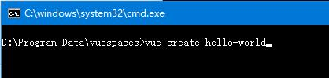</center> 
有两个选项：
<center>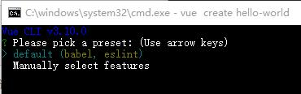</center>

```shell
default (babel, eslint)  // 默认配置，提供babel和eslint支持
Manually select features // 自定义选择需要的功能，提供更多的特性选择。
```

用方向键控制，选择Manually select features （手动选择功能）
<center>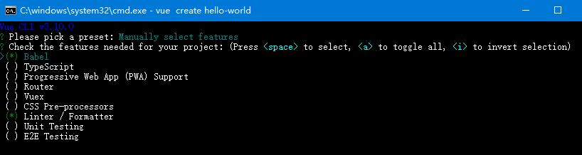</center>

按上下键切换选项，按空格键勾选和取消，按a全选，按i反选。

```
Babel                             // 指转移成浏览器识别的语言，可以让你的项目支持更新的语法。
TypeScript                        // 支持使用 TypeScript 编写程序
Progressive Web App (PWA) Support // PWA 支持，一般PC端是用不到。
Router                            // 支持 vue-router 。
Vuex                              // 支持 vuex 。
CSS Pre-processors                // 支持 CSS 预处理器。
Linter / Formatter                // 支持代码风格检查和格式化。
Unit Testing                      // 持单元测试。
E2E Testing                       // 支持 E2E 测试。
```

根据自己的情况进行选择，完成后按回车下一步：
<center>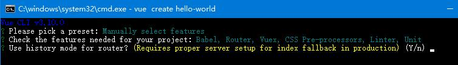</center>
Use history mode for router?*******history模式 这个看项目需要，history模式需后端支持，自行考虑。我们输入Y同意，然后选择CSS预处理语言，我选择less：
<center>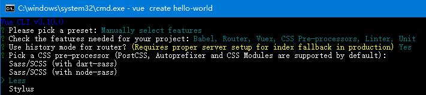</center>
接着选择ESLint的代码规范，此处使用Standard代码规范，我选择了ESLint+Standardconfig(正常提交)
<center>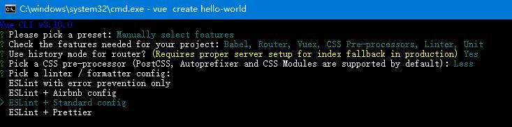</center>

```
ESLint with error prevention only // 只进行报错提醒
ESLint + Airbnb config            // 不严谨模式
ESLint + Standard config          // 正常模式
ESLint + Prettier                 // 严格模式
```

回车后，选择代码检查方式：
<center>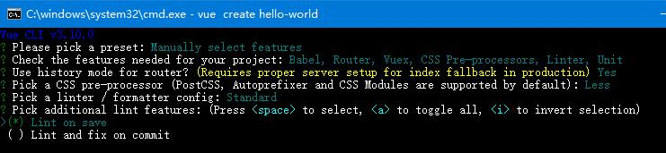</center>

```
Lint on save           // 保存时执行
Lint and fix on commit // 整理并固定提交时
```

我选择保存时执行，按回车继续，此时选择单元测试解决方案,我选择Jest:
<center>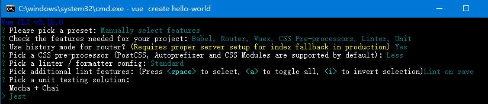</center>


接着，我们选择Babel、PostCSS、ESLint等文件存放位置，第一个是保存配置文件里，第二个是保存到package.json里，我选择第一个：
<center>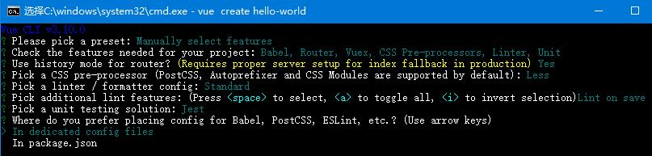</center>


回车后，提示是否保存配置，供以后项目使用，选择N。下次建立项目时另外配置。
<center>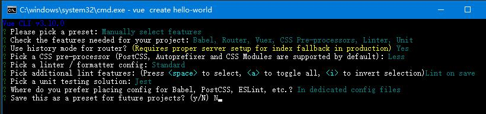</center>


然后选择依赖安装方式，我选择的是npm方式：
<center>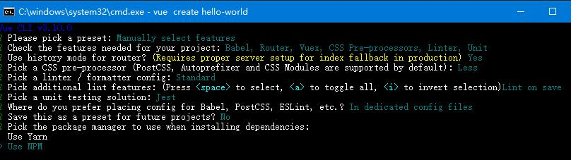</center>

然后就是等待创建完成了。