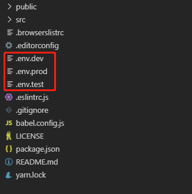

# vue-cli4.x创建的项目设置环境变量与部署

首先，通过```vue-cli4```创建好项目，比如项目名称叫```news-list```。
然后在项目根目录创建三个文件： ```.env.dev```, ```.env.test```, ```.env.prod```
<center></center>

分别编辑这三个文件：

1. ```.env.dev```

    ```
    NODE_ENV = 'development'
    VUE_APP_CURRENTMODE = 'dev'
    VUE_APP_BASEURL = '开发环境基础路径'
    ```

2. ```.env.test```

    ```
    NODE_ENV = 'production'
    VUE_APP_CURRENTMODE = 'test'
    VUE_APP_BASEURL = '测试环境基础路径'
    然后，编辑package.json文件
    ```

3. ```.env.prod```

    ```
    NODE_ENV = 'production'
    VUE_APP_CURRENTMODE = 'prod'
    VUE_APP_BASEURL = '生产环境基础路径'
    ```

在```scripts```里加入三条启动命令：

```javascript
"dev": "vue-cli-service serve --mode dev",
"test": "vue-cli-service build --mode test",
"prod": "vue-cli-service build --mode prod",
```

最后，项目启动：

```shell
npm run dev	 //本地运行
npm run test //测试环境打包
npm run prod //正式环境打包
```