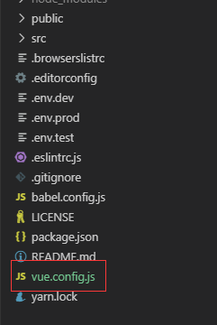
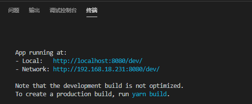
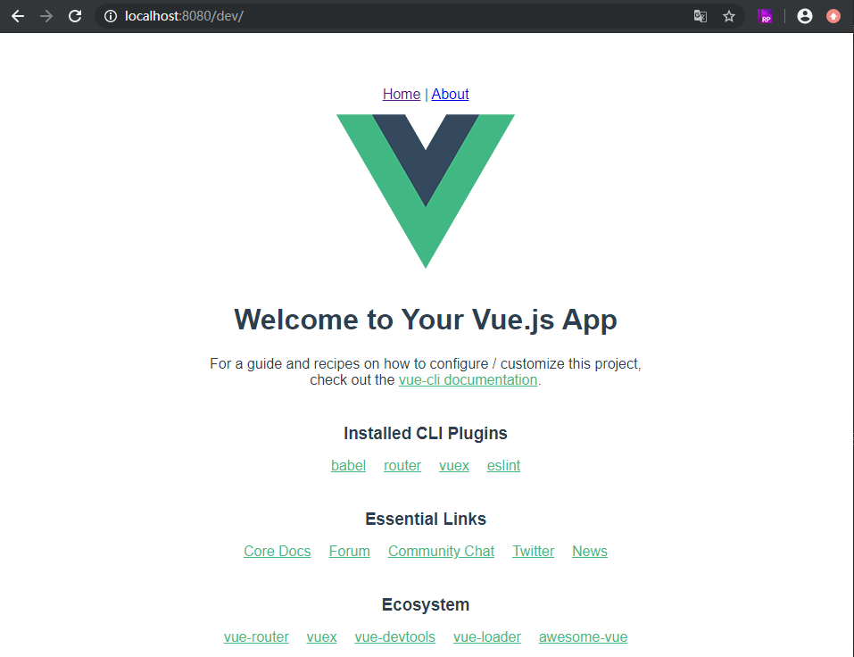
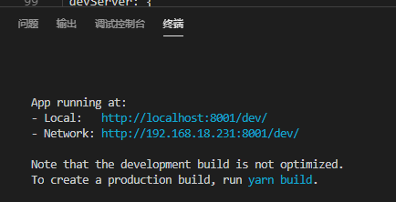

# vue实战——自定义基础路径，端口号

承接上文，设置环境变量：<a href='../002.vue-cli4.x创建的项目设置环境变量与部署/002.vue-cli4.x创建的项目设置环境变量与部署.md'>vue-cli4.x创建的项目设置环境变量与部署</a>

配置了环境变量有什么意义呢？当然是方便部署了。配置了环境变量后，就可以在自定义配置文件中，使用，比如配置基础路径、端口号等。那，如何配置呢？我们通过上文创建的项目，```news-list``` 中没看到有可以自定义的地方，别着急。这需要我们添加一个新的文件：```vue.config.js```。

在项目根目录下，创建文件：```vue.config.js```
<center></center>

<center style='font-style: italic;'>项目目录</center>

这个文件是做什么的呢？原来，```vue.config.js``` 是一个可选的配置文件，如果项目的 (和 ```package.json``` 同级的) 根目录中存在这个文件，那么它会被 ```@vue/cli-service``` 自动加载。你也可以使用 ```package.json``` 中的 vue 字段，但是注意这种写法需要你严格遵照 JSON 的格式来写。

这个文件应该导出一个包含了选项的对象：

```js
// vue.config.js
module.exports = {
 // 选项...
}
```

那么，基础路径该怎么写呢？我们在一般的文档中会发现，有的写法是这样的：

```js
module.exports = {
 baseUrl: '/myapp'
}
```

但是，`baseUrl` 从 Vue CLI 3.3 起已弃用，我们应该用`publicPath`。这个属性表示的是项目之前的公共路径，项目默认假设你的应用将会部署在域名的根部，比如 `https://www.my-app.com/`。如果你的应用时部署在一个子路径下，那么你需要在这里指定子路径。比如，如果你的应用部署在：`https://www.my-app.com/my-app/`，那么将这个值改为 `/my-app/`。这个值也可以被设置为空字符串 (`''`) 或是相对路径 (`'./'`)，这样所有的资源都会被链接为相对路径，这样打出来的包可以被部署在任意路径。

从官方文档中，我们可以发现，`publicPath` 是字符串类型，默认值就是 `'/'`，也就是根目录。同时这个值在开发环境下，同样生效。那如何与上文的自定义配置关联呢？原来，环境变量中的以 `VUE_APP_` 开头的变量会被 `webpack.DefinePlugin` 静态嵌入到客户端的包中(即在项目代码中使用)。你可以在应用的代码中这样访问它们：

```js
console.log(process.env.VUE_APP_BASEURL)
```

因此，在 `.env.dev` 中，我们定义了一组数据：

```js
NODE_ENV = 'development'
VUE_APP_CURRENTMODE = 'dev'
VUE_APP_BASEURL = '/dev'
VUE_APP_PORT = '8001'
```

同时，在 `vue.config.js` 中，我们引用上面的基础路径：

```js
module.exports = {
 publicPath: process.env.VUE_APP_BASEURL
}
```

然后，启动项目：

```shell
yarn dev
```

我们会发现，启动日志显示：

<center></center>

访问一下，发现基础路径出现了一个dev，没错。这就是我们设定的基础路径了。

<center></center>

但是我们发现，端口号还是默认的8080，如果系统中，这个端口号被占用了，我们想自定义一个，该怎么办呢？同样的，在自定义配置文件中，我们这样写：

```js
devServer: {
  port: process.env.VUE_APP_PORT
}
 ```

`process.env.VUE_APP_PORT` 依然是在自定义环境变量中的值。

这样在启动项目后：

<center></center>

我们发现，端口号变成了我们之前设定的8001了。

全部的配置文件如下：

`vue.config.js`
[官方文档-全局 CLI 配置](https://cli.vuejs.org/zh/config/#%E5%85%A8%E5%B1%80-cli-%E9%85%8D%E7%BD%AE)

```js
module.exports = {
  // 项目部署的基础路径
  // 我们默认假设你的应用将会部署在域名的根部，
  // 比如 https://www.my-app.com/
  // 如果你的应用时部署在一个子路径下，那么你需要在这里
  // 指定子路径。比如，如果你的应用部署在
  // https://www.my-app.com/my-app/
  // 那么将这个值改为 `/my-app/`
  // 这个值也可以被设置为空字符串 ('') 或是相对路径 ('./')，
  // 这样所有的资源都会被链接为相对路径，这样打出来的包可以被部署在任意路径
  publicPath: process.env.VUE_APP_BASEURL,
  devServer: {
    port: process.env.VUE_APP_PORT
  }
}
```

ok，到此本文就介绍到这了，除了这些我们还可以自定义其他的配置，具体可参考[官方文档](https://cli.vuejs.org/zh/config/)。