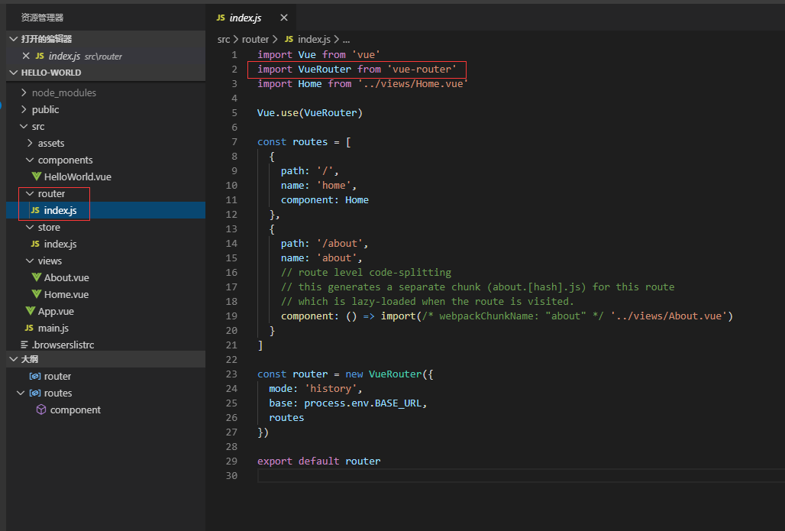
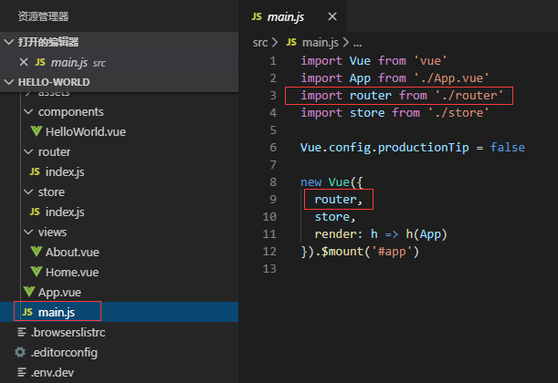
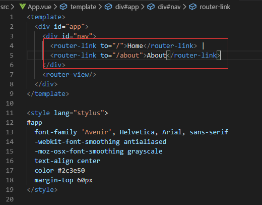
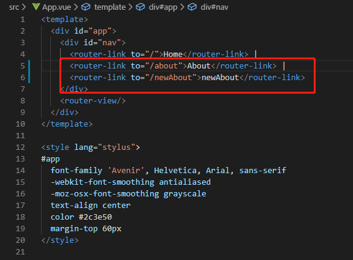
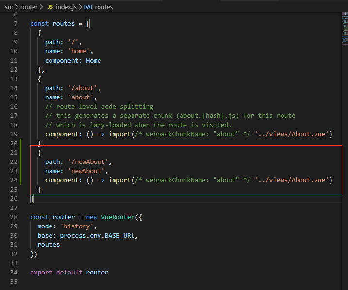
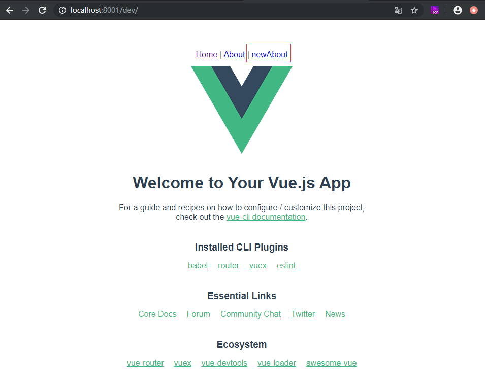

# Vue实战——vue-router路由的添加与配置
**接上文：<a href='../003.vue实战——自定义基础路径，端口号/003.vue实战——自定义基础路径，端口号.md'>vue实战——自定义基础路径，端口号</a>，继续我们的实战项目讲解之旅。本文讲解vue核心插件——vue router。**

在本项目中，使用了 `vue-cli4.1.1` 创建的，所以默认带了 `router`，那么，这个 `router` 是怎么被vue使用的呢？

~~任何插件首先得需要安装。
1.安装
npm install vue-router
然后我们~~

在 `package.json` 中会发现 `router` 已经被依赖进来了。那么怎么引用呢？在单独的模块中使用：

```ts
import Vue from 'vue'
import VueRouter from 'vue-router'
Vue.use(VueRouter)
```

比如本项目中的文件在：



*路由默认配置▲*

然后，我们在 `main.js` 中对 `router` 进行引用挂载



*main.js▲*

它挂载到了 `app` 这个元素上了，我们知道这个 `app` 就是我们项目整体的根元素。因此以后我们就可以在页面上进行路由配置了。

那么，在页面上，是如何进行路由的呢，我们用：

```xml
<router-link to="/xxx">Go to xxx</router-link>
```
同时在上图的路由文件中配置对应的 `xxx` 来进行路由导航。举个栗子：
我们的默认首页是 `App.vue`：



我们在 `id="nav"` 里加一个：

```html
<router-link to="/newAbout">newAbout</router-link>
```

如图：



在 `router` 的 `index.js `文件里加：

```ts
... // other code 
  {
    path: '/newAbout',
    name: 'newAbout',
    component: () => import(/* webpackChunkName: "about" */ '../views/About.vue')
  }
  ... // other code
```
如图(注意，这里是json格式，连接的逗号不要忘记)：



启动项目

```shell
yarn dev
```

发现首页上多了个导航：




以后，我们会根据这个方法添加属于我们自己的导航菜单。
接下来，我们详细多说说这个路由，我们发现路由页面的下面配置了一个：

```ts
const router = new VueRouter({
  mode: 'history',
  base: process.env.BASE_URL,
  routes
})
```

这个代码，那么这个是什么意思呢？这个配置，说明了我们的路由采用的是 HTML5 History 模式。这个模式是什么时候创建的呢？还记得我们用 `vue-cli4` 创建项目吗？对，就是在那时候创建的。<a href='../001.Vue使用vue-cli 3.10.0创建项目'>Vue使用vue-cli 3.10.0创建项目</a>

`vue-router` 默认 `hash` 模式 —— 使用 URL 的 `hash` 来模拟一个完整的 URL，于是当 URL 改变时，页面不会重新加载。

如果不想要很丑的 `hash`，我们可以用路由的 `history` 模式，这种模式充分利用 `history.pushState` API 来完成 URL 跳转而无须重新加载页面。

当你使用 `history` 模式时，URL 就像正常的 url，例如 `http://yoursite.com/user/id`，也好看！不过这种模式要玩好，还需要后台配置支持。因为我们的应用是个单页客户端应用，如果后台没有正确的配置，当用户在浏览器直接访问 `http://oursite.com/user/id` 就会返回 `404`，这就不好看了。

大家注意到了吗，上面的 `base` 的值，就是我们之前文章说的自定义的环境变量。有了 `base` 路径，在跳转的时候，就会自动加上这个路径了。

然后我们再看下routes里的内容：


那么，这些配置是什么意思呢？下篇文章我们继续分享。