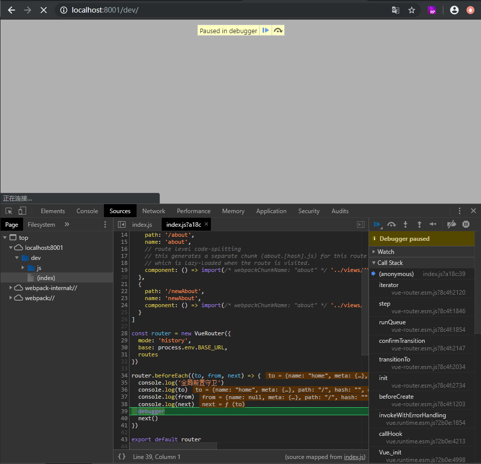

# vue实战——路由的导航守卫与从后台获取数据

**承接上文<a href='../004.vue实战——vueRouter路由的添加与配置'>vue实战——vueRouter路由的添加与配置</a>**

从本项目中的导航配置文件中，我们发现了：

```ts
{
  path: '/',
  name: 'home',
  component: Home
},
{
  path: '/about',
  name: 'about',
  // route level code-splitting
  // this generates a separate chunk (about.[hash].js) for this route
  // which is lazy-loaded when the route is visited.
  component: () => import(/* webpackChunkName: "about" */ '../views/About.vue')
 }
 ```

形如上面的代码，这是什么意思呢？不难理解，`path`，就是导航的 `url` 路径，`name` 则为导航的名称，`component` 则是导航到哪个目标组件。比如项目的初始目录是 `'/'`，则默认导航到了 `Home` 这个组件里，也就是项目的默认首页。当我们通过：

```html
<div id="nav">
  <router-link to="/">Home</router-link> |
  <router-link to="/about">About</router-link>
  <router-link to="/newAbout">newAbout</router-link>
 </div>
 <router-view/>
 ```
中点击 `Home` 时，就会通过路由的配置，将 `Home` 组件显示到 `<router-view/>` 的标记处。

可，问题是，假设我们需要在路由跳转前对用户身份做判断，常见的比如身份验证——必须在登录状态下才能进行跳转，那该怎么做呢？这里我们需要使用全局前置守卫：

```ts
const router = new VueRouter({ ... })

router.beforeEach((to, from, next) => {
 // ...
})
```

我们在项目中路由配置文件里加入：

```ts
router.beforeEach((to, from, next) => {
 console.log('全局前置守卫')
 console.log(to)
 console.log(from)
 console.log(next)
 debugger
 // 如果注释下面的方法，则导航不会正确跳转过去
 next()
})
```

启动项目，打开F12



我们发现，在路由跳转前，执行了我们这个代码，F8放行，则正常跳到首页。我们就可以在这里进行必要的身份验证了。
同样的，有了前置，还有后置：

```ts
router.afterEach((to, from) => {
 console.log('全局后置钩子')
 console.log(to)
 console.log(from)
 debugger
})
```

这些配置，都是全局生效，也就是说所有的跳转都会走这两个方法。那有没有只对某个跳转进行拦截呢？有的——路由独享守卫：

```ts
const router = new VueRouter({
  routes: [
    {
      path: '/foo',
      component: Foo,
      beforeEnter: (to, from, next) => {
        // ...
      }
    }
  ]
})
```

形如以上，我们在我们的news-list项目中，路由配置文件的newAbout模块加入以下代码：
beforeEnter: (to, from, next) => {
 console.log('newAbout独享的前置守卫')
 debugger
 next()
 },
意思就是当跳转newAbout这个导航时，才进行前置守卫。我们重启项目，进行跳转验证，发现只有当点击newAbout时，才走这个拦截。
到此，大家会发现，所谓的守卫，是什么呢？就是拦截器，它和后端服务的拦截器是一种思路，在执行逻辑前、后。进行统一拦截过滤。
当然除了全局、路由，还有组件级别的拦截，接下来我们创建一个新的组件：newAbout.vue
<template>
 <div>
 这是一个新的组件
 </div>
</template>

<script>

</script>

<style>

</style>
然后修改路由配置，将newAbout的组件改成新建的组件
component: () => import(/* webpackChunkName: "about" */ '../views/newAbout.vue')
重启项目，点击newAbout：


组件已经挂载上了。接下来，假设我们在跳转到newAbout组件后，需要从后台获取数据，那我们该怎么做呢？修改newAbout组件：
<template>
 <div>
 这是一个新的组件,从后台获取的数据={{value}}
 </div>
</template>

<script>
export default {
 name: 'newAbout',
 data () {
 return {
 value: ''
 }
 },
 created () {
 this.getData()
 },
 methods: {
 getData () {
 console.log('从后台获取数据开始')
 this.value = 'aaaa'
 }
 }
}
</script>

<style>

</style>
我们添加了一个getData的方法，模拟从后台获取数据，然后在组件created的时候调用，当我们重启项目后，访问：


页面出现了，模拟的数据。这就是导航跳转后，获取数据的方式之一。