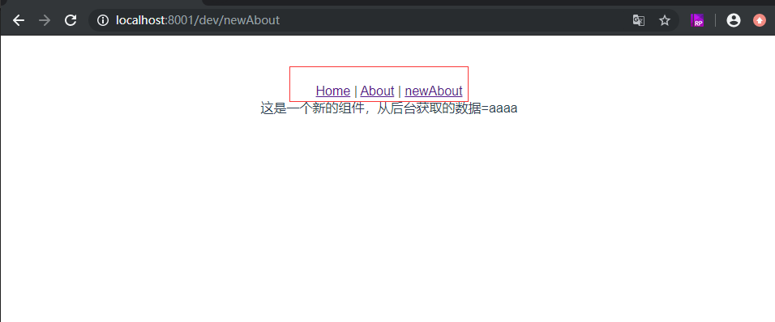
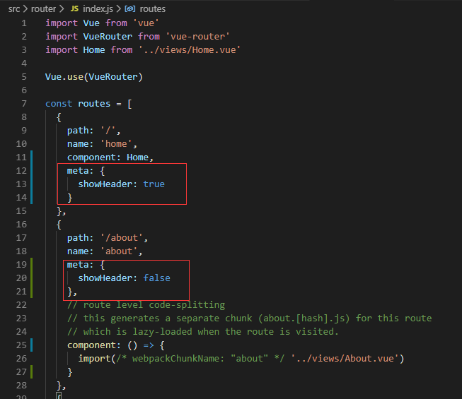
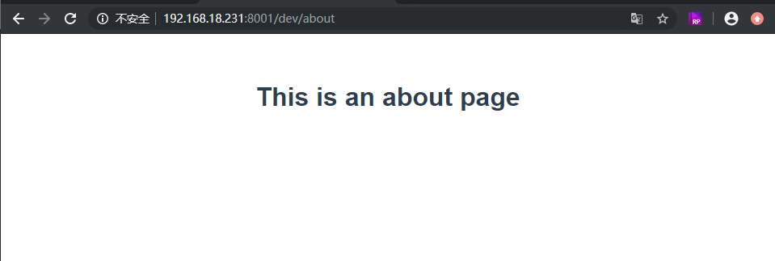

# Vue 实战——利用路由元信息隐藏页面跳转后的主路由

**承接上文：<a href='../005.Vue实战——路由的导航守卫与从后台获取数据/005.Vue实战——路由的导航守卫与从后台获取数据.md'> Vue 实战——路由的导航守卫与从后台获取数据</a>，继续我们的继续我们的实战之旅**。

当我们启动项目后，发现首页有导航栏：


_首页的导航栏 ▲_

然后我们点击 newAbout，发现依然有导航栏：



_newAbout 页面 ▲_

如果我们的项目中需要在一些页面中不显示导航栏，该怎么做呢？很简单，我们利用 Router 的元信息添加一个标志位，然后在主路由上对它动态的判断就可以了，具体的办法是：

编辑路由的配置文件：



_路由配置文件 ▲_

在每个路由里，添加

```ts
meta: {
  showHeader: true
}
```

首页路由为 `true`，其余的路由页面为 `false` 。然后在 `app.vue` 的主路由上对其判断：

```html
<div id="nav" v-show="$route.meta.showHeader">
  <router-link to="/">Home</router-link> |
  <router-link to="/about">About</router-link> |
  <router-link to="/newAbout">newAbout</router-link>
</div>
```

我们添加了

```py
v-show="$route.meta.showHeader"
```

每次在挂载组件后，对其做判断，如果为 `false`，就不显示了。这极大的方便了我们涉及我们的组件，后期我们会根据这个做新闻详情页。

现在我们重启项目发现，主页还有导航，但是 `about` 页已经没有导航了。



_about 页面 ▲_
